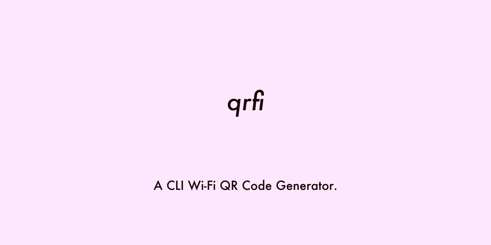
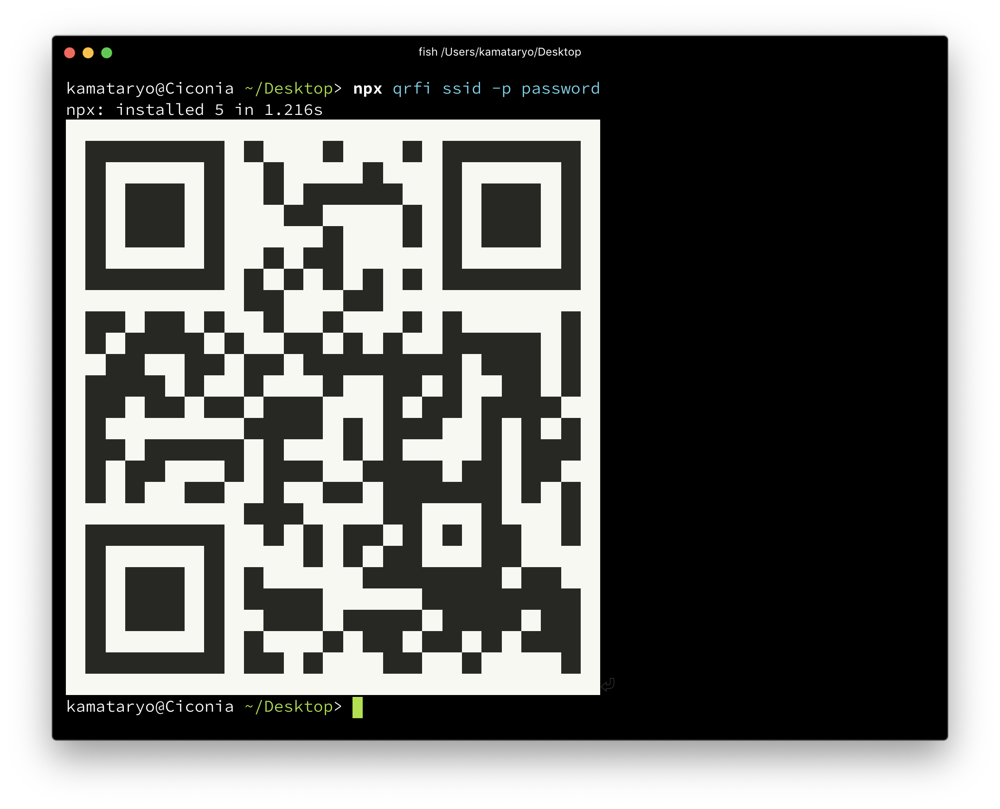

# qrfi

[](https://travis-ci.org/kamataryo/qrfi)
[](https://badge.fury.io/js/qrfi)

`qrfi` is a CLI Wi-Fi QR Code Generator. You can scan and configure Wi-Fi connection with QR Code.



## Prerequisites

### CLI

Node.js > 8

### Scanning device

- Android
- iOS 11+

## install

```shell
$ npm install qrfi --global
```

NOTE: Also you can use qrfi with `npx`command.

## Usage

```shell
$ qrfi your-ssid -p your-password
# or you can drain SSID from stdin
$ echo 'your-ssid' | qrfi -p your-password
```

With `npx`:

```shell
$ npx qrfi your-ssid -p your-password
# or you can drain SSID from stdin
$ echo 'your-ssid' | npx qrfi -p your-password
```



### options

```shell
$ qrfi -h
Usage: qrfi [ssid] [options]

A CLI Wi-Fi QR Code Generator.

Options:
  -V, --version                      output the version number
  -t, --authentication-type <value>  Optional. One of WEP, WPA, nopass. Default value is WPA.
  -p, --password <value>             Optional.
  -H, --hidden                       Optional. The SSID is hidden or not. Default value is `false`.
  -f, --format <value>               Optional. ascii as default, png or svg.
  -h, --help                         output usage information

Examples:
  $ qrfi <yourSSID> -p <your password>
  $ qrfi <yourSSID> -p <your password> -f png > qr.png
  $ echo <yourSSID> | qrfi -p <your password>
```

## development

```shell
$ git clone git@github.com:kamataryo/qrfi.git
$ cd qrfi
$ yarn
$ npm test
```

## contributions

Issues and pull requests are welcome.
